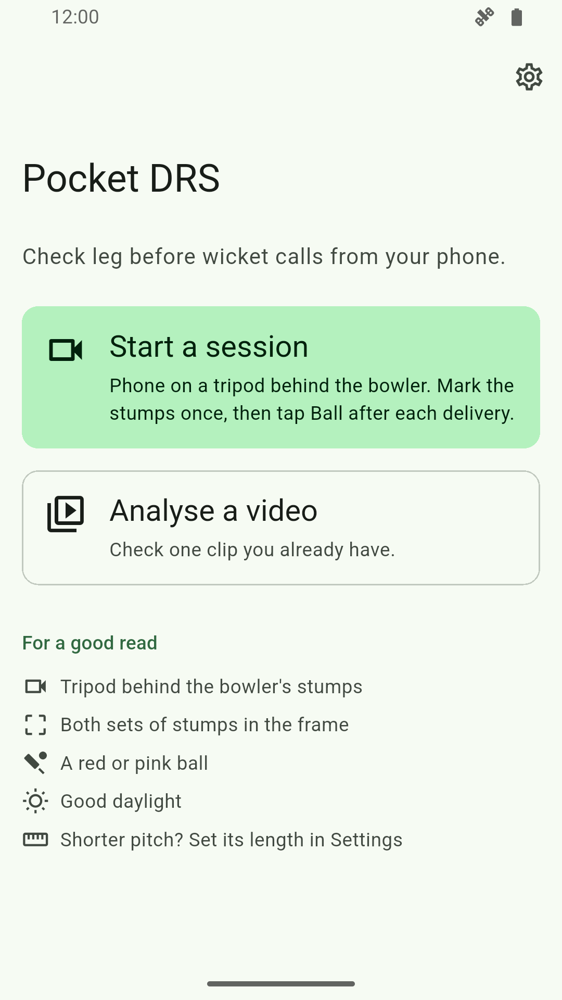
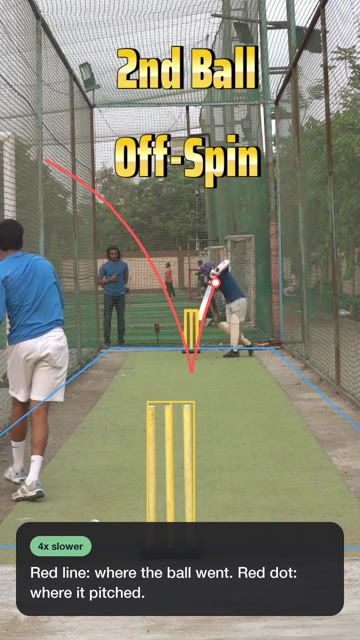
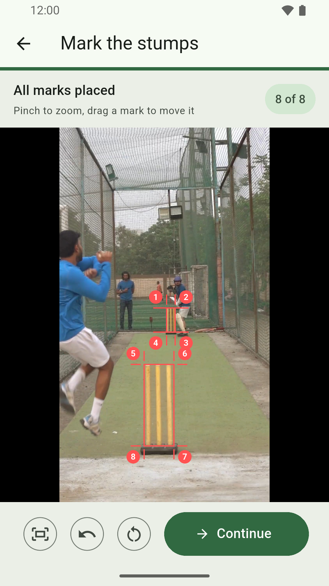
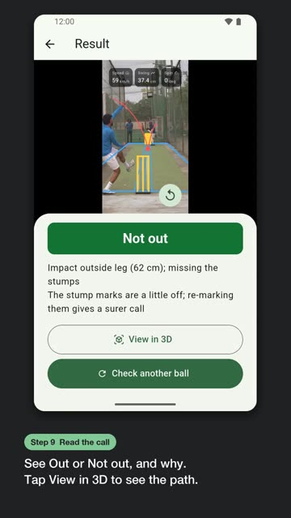
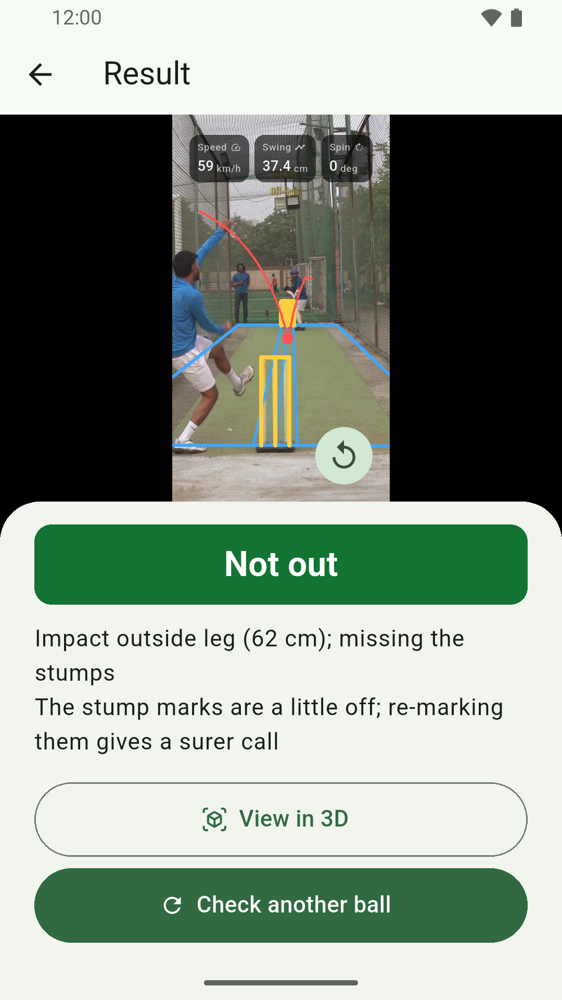
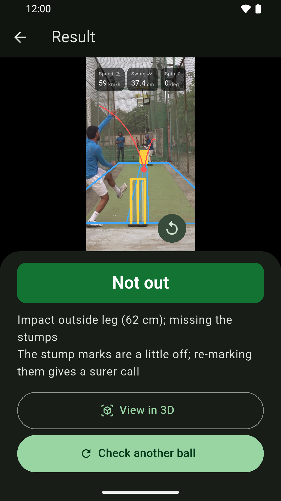
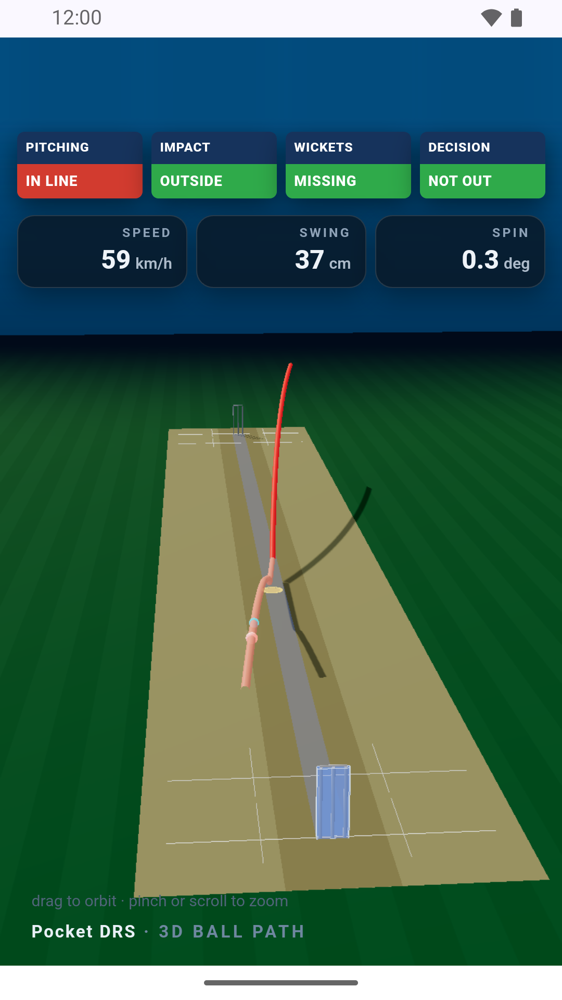
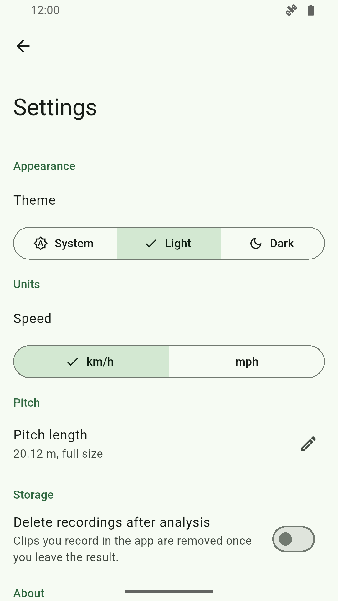

# Pocket DRS user guide

Pocket DRS checks close leg before wicket calls, known as LBW, using video from one phone. LBW is
a way a batter can be given out in cricket, when the ball would have hit the stumps but hit their
body first. You mark the stumps on the video, and the app works out where the ball pitched, where
it would have crossed the stumps, and gives a verdict under cricket's Law 36. It also shows the
ball's speed when it can work that out.

Pocket DRS is a coaching and training tool, not an official umpiring tool. It cannot tell whether
the ball hit the bat before the pad, so if the ball hit the bat first, the batter is not out
however the app calls it. It needs a red or pink ball in good light. It does not track a white
ball reliably.

## Get the app

Pocket DRS runs on Android 7.1.1 or newer. Download it from the
[latest release](https://github.com/kafle1/pocket-drs/releases/latest):

- **pocket-drs-arm64.apk** works on most phones. Start with this one.
- **pocket-drs-arm32.apk** is for older and budget phones. Use it if Android says the first file can't be installed.

Each file is under 20 MB. Open it on your phone, and allow installs from your browser when Android
asks. The app has no account and no sign-in, so it's ready as soon as it opens.

## Before you film

**Gear.** You need a phone and a tripod or another way to hold the phone still. A phone mount that
grips a tripod works well. Handheld footage moves too much for the app to track the ball.

**Where to put the tripod.** Stand the tripod behind the bowler's stumps, looking straight down
the pitch towards the batter. Both sets of stumps, the bowler's and the batter's, must be in
frame. The app checks this when you mark the stumps: if the marks show the phone standing on the
pitch instead of behind it, the app asks you to move back and re-mark.

**Height.** Set the tripod at about chest height. This keeps both sets of stumps clearly apart in
the frame, without tilting the phone down too far.

**Framing.** Keep the phone in portrait, the tall way up, with the full pitch running from the
bottom of the frame to the top. Leave a little space around both sets of stumps so a stump is
never right at the edge.

**Light.** Film in good daylight. The app finds the ball by its colour, and a dim or shadowed
pitch makes that harder.

**Ball colour.** Use a red or pink ball. Those are the two colours the app is built to track.

**Frames a second.** The app checks up to 60 frames of video for every second of the delivery.
When you record inside the app with **Start a session**, it sets your phone's camera to 60 frames
a second for you, so you don't need to change anything. If you record with your phone's own camera
app instead, for use with **Analyse a video**, set that app to its highest frame rate, ideally 60
frames a second or higher, if your phone offers it. More frames a second make a fast ball easier
to track.

Watch the short filming guide, made from a real delivery checked by the app:

## Marking the stumps

Both flows, recording a session and analysing a saved clip, ask you to mark the stumps on a still
frame from the video. You do this by tapping eight corners, one set of four for each end. Tap
them in this order:

1. Batter's stumps, top left
2. Batter's stumps, top right
3. Batter's stumps, bottom right
4. Batter's stumps, bottom left
5. Bowler's stumps, top left
6. Bowler's stumps, top right
7. Bowler's stumps, bottom right
8. Bowler's stumps, bottom left

The batter's stumps are the far set, at the striker's end. The bowler's stumps are the near set,
closest to the camera. If a set of four taps does not form a sensible rectangle, the app shows a
message telling you to tap that end's four corners again in order: top left, top right, bottom
right, then bottom left.

Tips for tapping accurately:

- Pinch to zoom in on the frame before you tap, so each corner is easier to hit.
- After placing a mark, you can drag it to fine-tune the spot. Dragging moves the mark slowly, for
  precision, and a small magnified view appears above or below your finger so the corner stays in
  view while you adjust it.
- Use **Fit to screen** to zoom back out and see all eight marks at once.
- Use **Undo** to remove your last mark, or **Clear all** to start over.
- The **Continue** button only turns on once all eight marks are placed.
- Marking the stumps a little off still gives a call, but a call from careful marks is more
  reliable. If the app's warnings mention the stump marks, re-marking them more carefully often
  fixes it.

## Recording a session or analysing a saved clip

Pocket DRS has two ways to check a delivery, both from the home screen.

### Start a session

Use this when you are filming live, ball after ball. Tap **Start a session**. The phone's camera
opens. A message tells you to stand the phone behind the bowler's stumps with both sets of stumps
in view, then tap **Mark stumps**.

Mark the eight stump corners as described above, then tap **Continue**. Choose the batter's
handedness, **Right-handed** or **Left-handed**. Now you are ready to record deliveries.

After each ball is bowled, tap **Ball**, or press a volume key on your phone. The app cuts the
last four seconds of video, which should cover the delivery, and sends it off for checking. A card
appears in a list showing that ball's progress: uploading, then analysing, then the result once
it's ready. Tap a card to open its full result. Swipe a card away to remove it from the list.

If you leave a session before it's done, a dialog asks **Leave session?** and warns that the
results there will be lost, with **Stay** and **Leave** buttons.

### Analyse a video

Use this when you already have a clip, either recorded earlier or just filmed. Tap **Analyse a
video**. Set the batter's handedness with the **Right-handed** / **Left-handed** switch, then tap
**Record video** to film one now, or **Choose from phone** to pick an existing clip.

Next, trim the clip down to just the delivery. Drag the two handles on the timeline to the ball
leaving the bowler's hand and to it reaching the batter, then tap **Use this part**. You need to
keep at least 0.2 seconds of video.

Then pick a clear, sharp frame from that trimmed part to mark the stumps on. Scrub through the
video, or step forward and back in tenths of a second, then tap **Use this frame**.

Mark the eight stump corners as described above, then tap **Continue**. The app sends the clip off
for checking.

Watch the whole flow in a 36 second video, from opening the app to the 3D view:

## Reading the result

Once a ball has been checked, you see the video with the ball's path drawn over it, a verdict if
one was reached, and any measurements the app could work out.

**The verdict.** A coloured banner reads **Out**, **Not out**, or **Umpire's call**, matching what
an on-field umpire's decision review would show. Below it, a line of text explains the call. If the
app also has a warning about the check, such as the stump marks being a little off, that line shows
too, under the reason, even when there is a banner above it.

**No call.** A grey No call banner means the app could not reach a confident verdict, usually
because the stump marks, the video, or the ball's visibility made the path too uncertain. The video
still shows the path the app tracked, as the next section explains. A line of text explains why,
using the same wording as the [Troubleshooting](#troubleshooting) table below.

**The path overlay.** Blue lines show the pitch and the area between the stumps, worked out from
your stump marks. Yellow lines show the two sets of stumps. A red line traces where the camera saw
the ball fly. When the app reaches a call, that red line continues on to the stumps, showing the
estimated rest of the path, and a small red dot marks where the ball pitched. When there is no
call, only the tracked part of the flight shows, with no estimated line and no pitching dot. If the
app never spotted the ball at all, no red line shows.

**Speed, swing, and spin.** Three small tiles show the ball's speed, how much it swung through the
air in centimetres, and how much it spun or turned off the pitch in degrees. Speed shows in
kilometres or miles an hour, whichever you picked in Settings. When the app could not work one of
these out, it shows a dash instead of a number.

**View in 3D.** When the app reaches a call, tap **View in 3D** to open the delivery in a 3D view
in your phone's browser, so you can look at the path from any angle. This button is not there when
there is no call, since the 3D view needs the full estimated path.

To check another ball, tap **Check another ball** on the analyse flow, or **Back to session** to
return to a session you're recording.

## Troubleshooting

If a message below appears, here is what it means and what to try.

### Connection and server problems

| Message you see | What it means | What to do |
|---|---|---|
| Can't reach the server. Check your internet, or try again later. | Your phone could not reach the server. Either your internet is down or the server is switched off. | Check your Wi-Fi or mobile data. If they work, the server is off for now, so try again later. |
| No reply in time. Check your internet, or try again later. | The server took too long to answer. | Check your connection. If it is fine, the server may be off, so try again later. |
| The server is off right now. Try again later. | The server's computer is online, but the checking program on it is not running. | Try again later. |
| The server is busy. Try this ball again in a minute. | The public server has too many jobs running at once. | Wait a minute, then try again. |
| Something went wrong checking this ball. Try again. | The server hit an error while checking. | Try again. If it keeps happening, the server may be down. |
| The server no longer has this ball, maybe after a restart. Send it again. | The server restarted while checking your ball, or the ball is more than a day old. | Tap the circular arrow next to the ball to send it again. |
| Lost the connection while checking this ball. Try again. | The app lost touch with the server partway through checking. | Check your connection and try again. |
| This ball took too long to check. Try again. | The check ran longer than the app waits for. | Try again, ideally on a better connection. |
| Could not check this ball. Try again. | The server sent back something the app could not read. | Try again. |

### Problems with the video or stump marks

| Message you see | What it means | What to do |
|---|---|---|
| No ball found. Check the ball is clearly visible, or re-mark the stumps. | The app could not spot a ball at all in the clip. | Use a red or pink ball, film in good light, and re-mark the stumps. |
| The stump marks don't line up. Zoom in and re-mark the corners of both sets of stumps. | Your eight taps don't describe a shape the app can make sense of. | Zoom in and re-mark both sets of stumps carefully. |
| The stump marks put the phone somewhere it can't be. Mark the batter's stumps first, then the bowler's. | The marks imply an impossible camera position. | Re-mark the stumps, batter's end first, then bowler's end. |
| The stump marks don't look like two sets of stumps. Re-mark the corners of both. | The two rectangles you marked don't look like a real pitch from this angle. | Re-mark both ends of the pitch. |
| The stump marks put the phone on the pitch. It must stand behind one set of stumps, looking down the pitch. Re-mark the stumps. | The marks suggest the camera is standing on the pitch rather than behind it. | Move the tripod behind one set of stumps and re-mark. |
| Could not open the video. | The app could not open the video file at all. | Try a different clip. |
| No frames in the selected part of the video. | The trimmed part of the clip has no usable video in it. | Trim a different, longer part of the clip. |

### Warnings that come with the result

These appear as the explanation text under a result. Some only show up when the app could not
reach a verdict, alongside another message like the ones above; if a verdict was reached, you may
not always see every one of these even when it applies.

| Message you see | What it means | What to do |
|---|---|---|
| the stump marks are a little off; re-marking them gives a surer call | The app gave a verdict, but your stump marks were not very precise. | Re-mark the stumps more carefully next time for a surer call. |
| no ball found; use a red or pink ball in good light, with the whole pitch in view | The app never spotted the ball moving through the frame. | Use a red or pink ball, film in good light, with the whole pitch in view. |
| no call, as the ball was still in flight where the check stopped; trim the clip to just the delivery | The clip or the frame limit ran out while the ball was still moving. | Trim the clip closer to just the delivery, from release to the batter. |
| the ball's path doesn't match the stump marks; re-mark the stumps or try a clearer clip | The ball's tracked path and your stump marks don't agree well enough. | Re-mark the stumps, or try a sharper, steadier clip. |
| no bounce seen, so the ball was treated as a full toss | The app didn't see the ball pitch, so it assumed it reached the batter without bouncing. | If the ball did bounce, try a clip where the bounce is clearly visible. |
| the ball's path couldn't be carried on to the stumps; try a clip where the ball stays in view up to the batter | The ball went out of frame too early to predict its path to the stumps. | Film so the ball stays in view up to the batter. |
| the stump marks aren't precise enough for a call; zoom in and re-mark the corners | The app could not tell how precise your taps were. | Zoom in and re-mark the corners carefully. |
| the ball's path is too unsure to call; re-mark the stumps or try a clearer clip | The estimated path has too much uncertainty for a safe verdict. | Re-mark the stumps, or try a clearer, steadier clip. |
| speed not shown, as the ball was seen too briefly to time it; keep the bowler's hand in view | The ball was visible for too short a stretch to time it. | Keep the bowler's hand and the start of the delivery in view. |
| speed not shown, as the stump marks leave it unsure; zoom in and re-mark the corners | Small errors in the stump marks change the speed more than the ball's path does. | Zoom in and tap the stump corners again. |
| only the first X.X s were checked; trim the clip to just the delivery | The clip was longer than the app checks in one go. | Trim the clip down to just the delivery before sending it. |

## Settings

Open Settings from the gear icon on the home screen.

- **Appearance.** Choose **System**, **Light**, or **Dark** for the app's theme.
- **Units.** Choose **km/h** or **mph** for the ball's speed.
- **Pitch.** Set the pitch length, from the batter's stumps to the bowler's stumps. This sets the
  scale for speed and the 3D view. Tap **Full size** for a standard pitch, 20.12 metres (22
  yards), or enter your own length between 10 and 25 metres for a shorter net.
- **Storage.** On phones, a switch called **Delete recordings after analysis** removes clips you
  record in the app once you leave the result screen.
- **About.** Shows the app version, a **Source code** link to the free, open source code on
  GitHub, and a **Privacy policy** link.

### Server address

There is no setting in the app to change which server it talks to. The app is built to always use
one server address, and by default that is the free public server the app ships with. This can
only be changed by building your own copy of the app with a different address baked in.

### Running your own server

If you want to run your own copy of the server, for privacy or to avoid the shared public server,
the project's main README explains how to set it up and run it, and the `server/Dockerfile` shows
how it's packaged to run as a container. You would then build your own copy of the app with
`--dart-define=POCKET_DRS_SERVER_URL=https://your-server-address`, so it points at your server
instead of the public one. That's a developer task, not something you do from within the app.

## Privacy

Pocket DRS has no accounts, no ads, and no analytics. The server deletes your video once it has
finished checking it, and keeps only the numbers from the result for a day. Read the full
[privacy policy](privacy-policy.md) for exactly what leaves your phone.

## Screenshots

